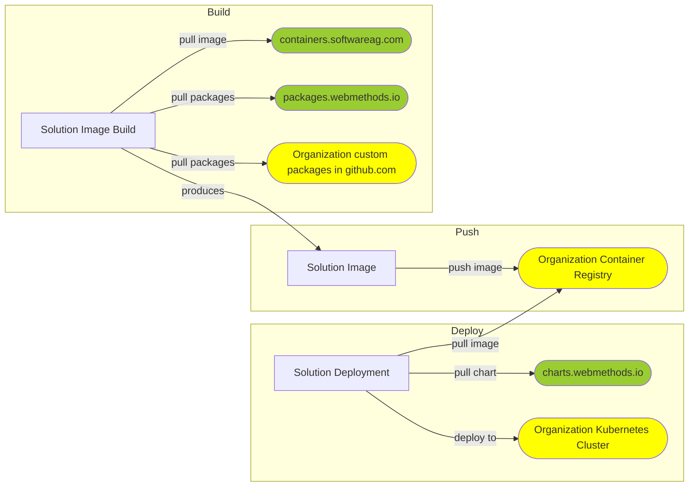

# webMethods Private Cloud Factory

# General information
A template repository for kick-starting Private Cloud CI/CD creation for webMethods products. 

# Prerequisites
- :package: Container registry for pushing your customized image(s)
- :cloud: Kubernetes cluster for deploying your solution(s)
- :key: Define the following secrets for accessing the **Software AG** services:
  - SAG_CR_USER (secret) - Username for https://containers.softwareag.com/
  - SAG_CR_PASSWORD (secret) - Password/token for https://containers.softwareag.com/
  - SAG_WPM_TOKEN (secret) - Token for https://packages.webmethods.io/
- :key: Define the following secrets/vars for accessing **your organization** services:
  - DOCKER_REGISTRY (var) - Your container registry server
  - DOCKER_USER (secret) - Username for your container registry
  - DOCKER_PASSWORD (secret) - Password/token for your container registry
  - KUBE_CONFIG (secret) - The kubeconfig file content for accessing your Kubernetes cluster

# Usage
- Use the template by clicking "Use this template" at the top and specify the new repository name
- Actions -> CI/CD -> Run workflow -> Provide container and/or deployment specifics -> Run workflow
- Alternatively, edit the .github/workflows/cicd.yml workflow for embedding the container and/or deployment specifics, specify triggers or add extra configurations.

# Result

# Used Software AG services and tools
- https://containers.softwareag.com/ - Software AG Container registry
- https://packages.webmethods.io/ - webMethods Packages registry
- https://charts.webmethods.io - webMethods Helm charts registry
- https://github.com/sag-private-cloud/sag-build-image - webMethods GitHub action for building customized webMethods container images
- https://github.com/sag-private-cloud/sag-helm-add-repo - webMethods GitHub action for adding the webMethods Helm charts registry
- https://github.com/sag-private-cloud/sag-helm-deploy - webMethods GitHub action for deploying webMethods Helm charts
- https://github.com/sag-private-cloud/private-cloud-factory - This template repository as a kick-starter for workflow orchestration
